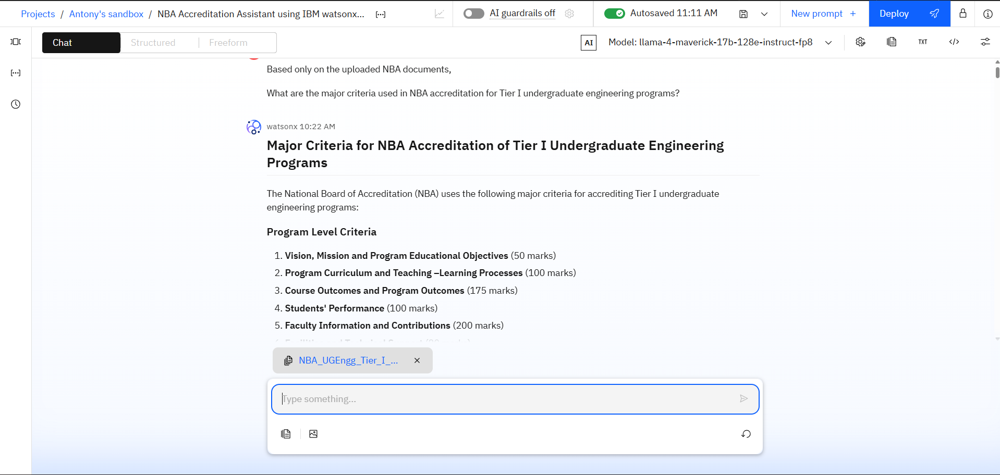
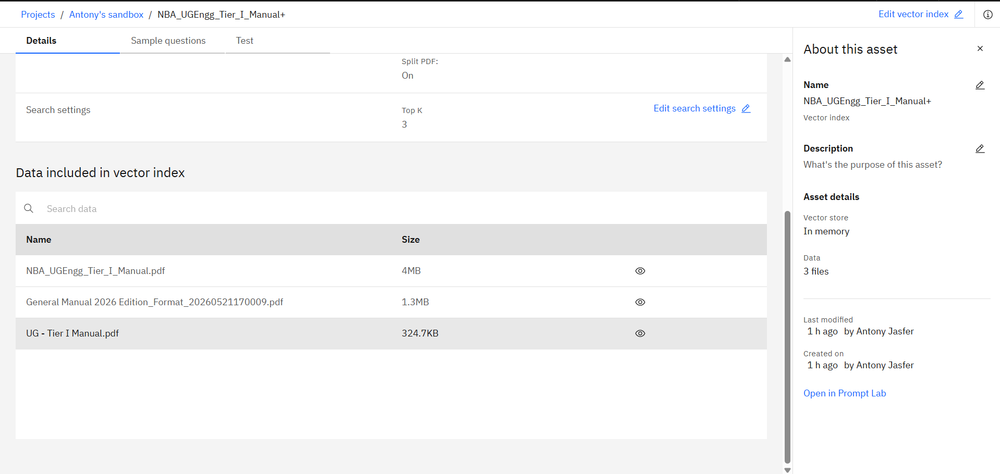
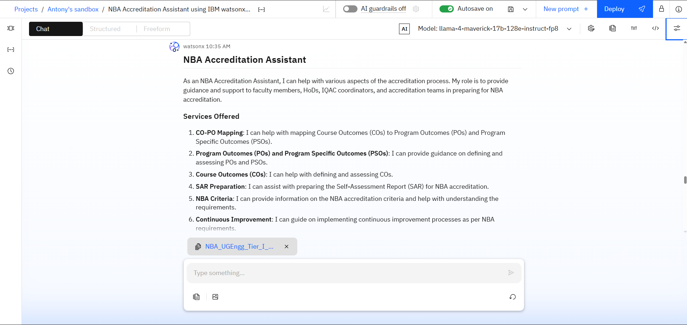
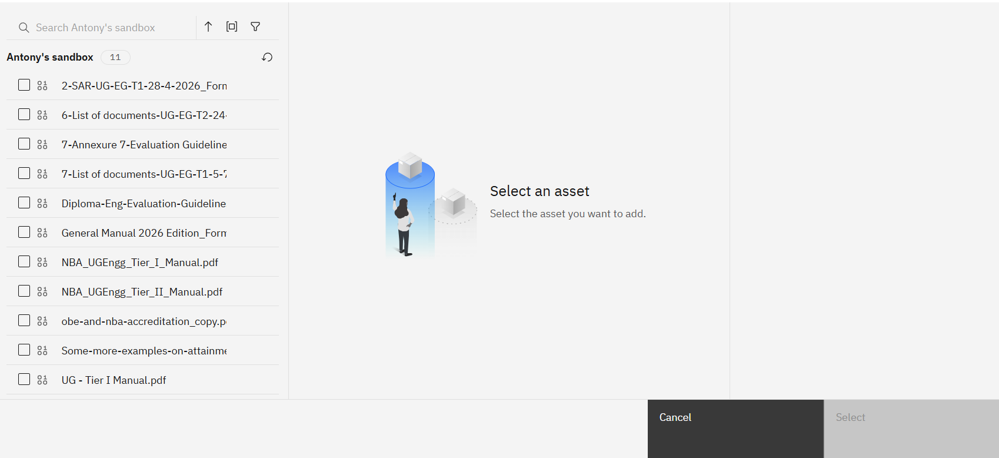

# NBA Accreditation Assistant using IBM watsonx.ai and RAG

## Overview

The NBA Accreditation Assistant is an AI-powered Retrieval-Augmented Generation (RAG) system developed using IBM watsonx.ai.

The assistant helps faculty members, accreditation coordinators, and educational institutions quickly retrieve information from official NBA accreditation documents.

## Features

- AI-powered question answering
- Retrieval-Augmented Generation (RAG)
- Vector-based document search
- Source-grounded responses
- NBA accreditation knowledge base
- IBM watsonx.ai implementation

## Technologies Used

- IBM watsonx.ai
- IBM Prompt Lab
- Vector Index
- Llama 4 Maverick Foundation Model
- Retrieval-Augmented Generation (RAG)
- GitHub

## Knowledge Base

The assistant uses:

- General Manual 2026
- NBA UG Engineering Tier-I Manual
- Self Assessment Report (SAR)

## System Architecture

## Workflow

1. User submits a query
2. Vector Index retrieves relevant document chunks
3. Retrieved content is passed to the LLM
4. Llama 4 Maverick generates a grounded response
5. User receives an answer based on NBA documents

## Screenshots

### Project Dashboard

### Vector Index

### Query Example

### RAG Response

## Results

The system successfully answers:

- NBA Accreditation Criteria
- CO-PO Mapping
- SAR Documentation
- Evaluation Guidelines
- Accreditation Visit Requirements

## Repository Structure

NBA-Accreditation-Assistant/
├── README.md
├── architecture/
├── screenshots/
├── docs/

## Future Enhancements

- Web Application Interface
- Chat History
- Additional NBA Documents
- Voice-based Query Support
- Multi-document Retrieval

## Author

Antony Selva Jasfer A
